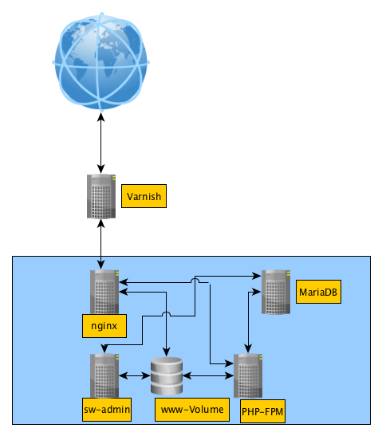

# Shopware Docker
This Docker image collection provides a ready-to-go solution for Shopware. It's based on nginx, php-fpm, MariaDB and Varnish. Furthermore, it provides a simple SCP-Server for up-/downloading files.

## Structure


# Using it
## Setup
Just edit the `live.env`-file, check the `docker-compose.yml` and run:

```
docker-compose up -d
```
The images will be built.  

When the machines are booted, run the Shopware installation script:

```
docker exec -it sw-admin installSW
```
This will download and install Shopware. Furthermore, the plugins defined in the `STORE_ADDONS` within the `docker-compose.yml`-file will be downloaded and activated. The plugins defined in the `INSTALL_ADDONS`-section will be installed.

If you are going to put your Shopware instance behind an https-secured reverse-proxy, uncomment the line

```
#fastcgi_param  HTTPS 'on';
```

in the file `build/nginx/config/default.conf`. This will tell Shopware to use HTTPS URLs for images, scripts, etc..

Finally, the shopware-instance will be found at [http://localhost:8080](http://localhost:8080). The backend will be at [http://localhost:8080/backend](http://localhost:8080/backend) where you can login with the credentials `demo/demo`.

A SCP-Connection can be established to `localhost:2222` using the credentials defined in the `docker-compose.yml`.

## the `sw-admin` machine
The docker-container `sw-admin` contains shopware's cli tool _`console`_. You can run the commands via your cli by calling:

```
docker exec -it sw-admin console
```

Example Scenario: You want to download and install Shopware's Demo Data. Just run this commands:

```
docker exec -it sw-admin console sw:store:download SwagDemoDataDE
docker exec -it sw-admin console sw:plugin:install --activate SwagDemoDataDE
```

The `sw-admin`-container might also be the point for running backups.

# Troubleshooting
If the categories are empty, just run
```
docker exec -it sw-admin console sw:es:index:populate
```

This will populate the elasticsearch index and the categories are filled with products.

# Possible improvements
You might want to run all the machines within an VPN or virtual network and only forward the needed ports to the public. Maybe a [reverse-proxy docker](https://github.com/jwilder/nginx-proxy) is also a good idea.

# Help wanted / needed
If you have any ideas and improvements or questions to commit, feel free to do so :).
